 

## PROFILE

Analista de Dados e Desenvolvedor Full Stack com atuação ponta a ponta em **dados, automação, APIs e aplicações web**.

Minha experiência combina **SQL, ETL, Power BI, Python e desenvolvimento Full Stack** para construir soluções que saem do problema de negócio e chegam até a implantação: modelagem, integrações, back-end, interface, dashboards, permissões, relatórios e publicação em cloud.

> **FOCUS**  
> Transformar dados e processos complexos em produtos digitais claros, confiáveis e escaláveis.

 

## TECHNOLOGY SYSTEM

### DATA / ANALYTICS

  

  

### APPLICATION / AUTOMATION

## EXPERIENCE

<table>
<tr>
<td width="24%"><b>2025 — CURRENT</b></td>
<td><b>ACFS Consultores</b> Data Analyst / Full Stack Web solutions, dashboards, automations, deployment, domains and cloud publication.</td>
</tr>
<tr>
<td><b>2024 — 2025</b></td>
<td><b>Açovisa</b> Data Analyst SQL, Power BI, Python, Power Query, DAX, Azure Data Factory and C# table migration support.</td>
</tr>
<tr>
<td><b>2023 — 2024</b></td>
<td><b>WFLOW INVEST</b> Junior Developer Python and Power Automate automations with Power BI support.</td>
</tr>
<tr>
<td><b>2023</b></td>
<td><b>Fortuna PABX em nuvem</b> IT Support Intern CRM integration, customer training and technical support.</td>
</tr>
</table>

## SELECTED WORK

> Este espaço deve concentrar projetos que comprovem sua atuação atual: **dashboards, APIs, automações, SQL/ETL e sistemas Full Stack**.

## GITHUB SIGNAL

## EDUCATION

**Analysis and Systems Development**  
Centro Universitário ENIAC — 2023–2025

 

## CONTACT

### Building with data, automation and software.

